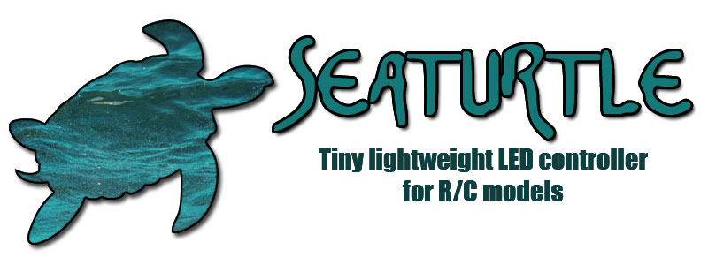
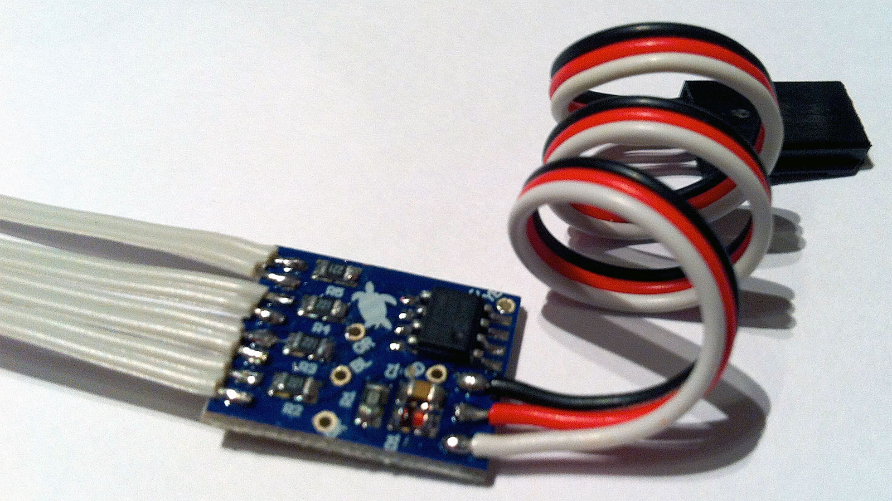
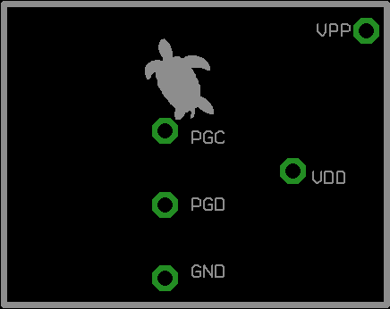

<p align="center">
  
</p>

<p align="center">
  
</p>

# SEATURTLE — Tiny lightweight LED controller for R/C models

SEATURTLE è una centralina luci pensata per essere il più piccola e leggera possibile: monta tutti i componenti in SMD su un PCB di pochi millimetri, con un solo connettore di ingresso dalla ricevente e quattro uscite per i LED del modello.

Questo repository contiene **quattro firmware alternativi**, per due tipologie di modello (drift / switch) in due varianti ciascuno (classic / xenon):

| Firmware | Cartella | Manuale | Uscite | Note |
|---|---|---|---|---|
| **Drift Classic** | [`/fw/2016_drift_classic`](fw/2016_drift_classic) | [seaturtle_drift.pdf](man/seaturtle_drift.pdf) | fari, coda, retro, scarico | fari anteriori bianco caldo |
| **Drift Xenon** | [`/fw/2016_drift_xenon`](fw/2016_drift_xenon) | *(vedi manuale Drift Classic, cambia solo l'effetto dei fari)* | fari, coda, retro, scarico | fari anteriori con effetto xenon (bianco freddo, accensione graduale) |
| **Switch Classic** | [`/fw/2016_switch_classic`](fw/2016_switch_classic) | *(nessun manuale — funzionamento elementare, vedi sotto)* | fari (x2), coda (x2) | semplice ON/OFF in base al canale radio |
| **Switch Xenon** | [`/fw/2016_switch_xenon`](fw/2016_switch_xenon) | *(nessun manuale — funzionamento elementare, vedi sotto)* | fari (x2), coda (x2) | come Switch Classic, con effetto xenon in accensione sui fari |

Al momento è disponibile un manuale ufficiale solo per la versione **Drift**; le versioni **Switch** non ne hanno uno dedicato perché il loro funzionamento è volutamente elementare (vedi punto 2).

## 1. Il progetto

SEATURTLE ha un solo connettore di ingresso dalla ricevente e 4 uscite a due poli per il collegamento diretto dei LED. L'alimentazione richiesta è compresa tra 4,5V e 6,5V, prelevata direttamente dal modello; il manuale segnala che la scheda potrebbe non funzionare correttamente con l'elettronica di serie di alcuni modelli Tamiya.

Nelle versioni **Drift**, tramite l'adattatore fornito la centralina va collegata in parallelo al regolatore motore, in modo che il segnale di gas/freno arrivi sia all'ESC sia alla SEATURTLE. Nelle versioni **Switch**, l'ingresso va invece collegato a un canale libero della ricevente (tipicamente un canale ausiliario a 2 posizioni) usato semplicemente come interruttore per le luci.

## 2. Funzionamento del firmware

### Drift Classic / Drift Xenon

Il firmware (`SeaTurtle.c`) legge il canale gas/freno dell'ESC e gestisce quattro uscite: fari anteriori (`HEAD`), luci posteriori (`TAIL`), retromarcia (`REV`) ed effetto fiammata di scarico (`EXH`, con un pattern di lampeggio "backfire" predefinito).

La calibrazione è **completamente automatica**: all'accensione la centralina rileva il segnale gas, dopo qualche secondo accende le luci posteriori e chiede una breve accelerata (~1 secondo) per determinare se il canale gas è invertito o meno; completata questa fase, si accendono anche i fari anteriori e la scheda è operativa. Il valore di neutro e di finecorsa vengono salvati in EEPROM (`EEPROM_TESTED`, `EEPROM_PPMNEUTRAL`, `EEPROM_PPMFULL`). **Non è richiesta alcuna regolazione manuale.**

L'unica differenza tra le due varianti è l'effetto dei fari anteriori: **Classic** li accende semplicemente a piena luminosità (bianco caldo), mentre **Xenon** li accende con un effetto di accensione graduale a PWM (tipico delle lampade allo xeno, reso con luci bianco freddo).

### Switch Classic / Switch Xenon

Il firmware (`SeaTurtle.c`, versione switch) è molto più semplice: legge un singolo canale a 2 posizioni e si limita ad accendere (`HEAD1/HEAD2`, `TAIL1/TAIL2`) o spegnere tutti i LED in base alla posizione del canale, con una soglia fissa a 1500µs e una piccola isteresi anti-glitch. **Non usa l'EEPROM e non richiede alcuna calibrazione**: basta collegarla e usarla.

Anche qui l'unica differenza tra le due varianti è l'effetto dei fari: **Classic** li accende/spegne di netto, **Xenon** aggiunge lo stesso effetto di accensione graduale a PWM della versione Drift Xenon, applicato ai fari anteriori.

## 3. Compilatore

Tutti e quattro i firmware sono scritti per **mikroC PRO for PIC** di [MikroElektronika](https://www.mikroe.com/mikroc-pic), per lo stesso microcontrollore **PIC12F629** usato in Grizzly3 (datasheet in [`/ref`](ref/PIC12F629-675.pdf)), e rientrano tutti ampiamente nel limite di 2048 program word della licenza gratuita:

| Firmware | ROM usata | % sul totale |
|---|---|---|
| Drift Classic | 605 / 1024 word | 59% |
| Drift Xenon | 662 / 1024 word | 65% |
| Switch Classic | 159 / 1024 word | 16% |
| Switch Xenon | 222 / 1024 word | 22% |

Non è quindi necessaria alcuna licenza a pagamento per compilare o modificare questi firmware.

## 4. Programmazione della scheda

**Non è necessario mettere mano al codice sorgente.** Per programmare la scheda è sufficiente collegare il PIC12F629 a un programmatore compatibile, ad esempio un **PICkit 2/3/4**, e caricare il file `.hex` già compilato della versione desiderata (nella rispettiva cartella `/fw/2016_*`).

Il PCB espone 5 pad ICSP (`VPP`, `VDD`, `GND`, `PGD`, `PGC`), con la disposizione mostrata nello schema seguente:

<p align="center">
  
</p>

Non sono richieste altre operazioni dopo il flashing:
- nelle versioni **Drift**, la calibrazione del canale gas è automatica, come descritto al punto 2;
- nelle versioni **Switch** non è prevista alcuna calibrazione: la scheda è già pronta all'uso.

## 5. Il PCB

Il circuito stampato è stato disegnato in **Eagle CAD** (file sorgente: [`/brd/seaturtle.brd`](brd/seaturtle.brd)).

Nella cartella [`/brd/gerber`](brd/gerber) sono presenti tutti i file Gerber (e uno `.zip` già pronto con l'intero pacchetto, `gerber_seaturtle.zip`) necessari per far produrre il PCB su un servizio di fabbricazione esterno, ad esempio [JLCPCB](https://jlcpcb.com/), [PCBWay](https://www.pcbway.com/) o simili: è sufficiente caricare l'archivio `.zip` (o i singoli file Gerber) nel loro configuratore online per ottenere un preventivo e ordinare le schede.

Nella cartella [`/assembling`](assembling) è presente la distinta componenti (`componenti.xls`), utile per l'assemblaggio della scheda (tutti componenti SMD in package 0805, PIC12F629-I/SN).

## Struttura del repository

```
seaturtle/
├── assembling/      # Distinta componenti e schema piedinatura ICSP
├── brd/             # Progetto Eagle CAD (.brd) e file Gerber
├── fw/
│   ├── 2016_drift_classic/    # Fari bianco caldo, calibrazione automatica
│   ├── 2016_drift_xenon/      # Come sopra, con effetto xenon sui fari
│   ├── 2016_switch_classic/   # Semplice ON/OFF via canale radio
│   └── 2016_switch_xenon/     # Come sopra, con effetto xenon sui fari
├── man/             # Manuale utente (solo versione Drift)
├── ref/             # Datasheet PIC12F629/675
├── seaturtle.jpg
└── seaturtle_logo.jpg
```

## Licenza

Questo progetto è distribuito con licenza **MIT** — vedi il file [LICENSE](LICENSE).
